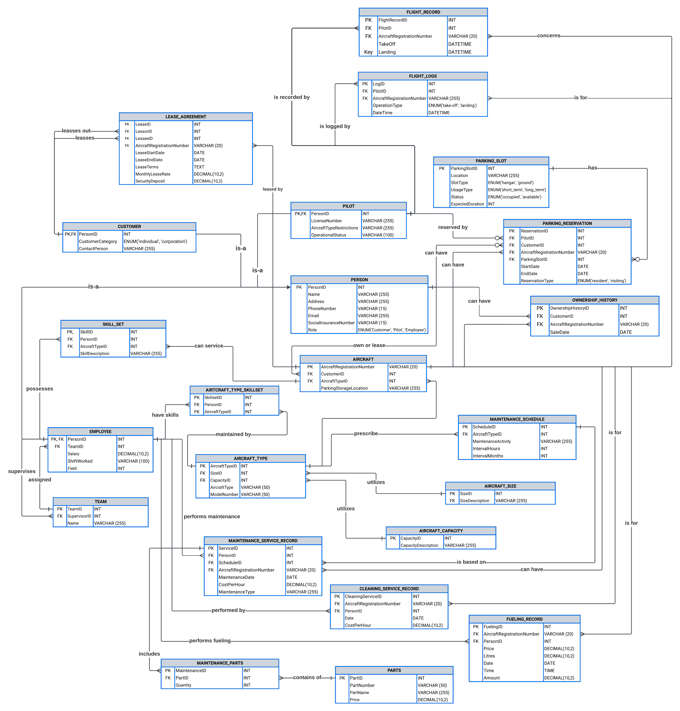

# AirMan-Database-System
This repository contains the design and implementation of the AirMan System for managing airport operations at London Biggin Hill Airport. It includes an ERD diagram, MySQL scripts for database creation, data insertion, and queries, as well as detailed data definitions and system requirements documentation.

## Background

London Biggin Hill Airport is a general aviation airport at Biggin Hill in the London Borough of Bromley, approximately 14 miles south-southeast of Central London. The airfield has been publicly owned by the London Borough of Bromley since 1974 and evolved into a private airfield in 1994 when it was leased by Biggin Hill Airport Ltd. to run it on a commercial basis. It is effectively a public-private partnership. Its commercial potential took a turn for the better when Bombardier announced its European relocation from Amsterdam to London Biggin Hill in 2016. Furthermore, the London Aerospace & Technology College funding was secured in 2018, as was planning for an Airport Hotel.

The airport has a Civil Aviation Authority (CAA) Ordinary Licence that allows flights for the public transport of passengers or flying instruction. The airport specializes in general aviation, handling a spectrum of traffic from private aviation to large business jets. It has no scheduled airline service, as flights using the airport are not permitted to carry fare-paying passengers.

The airport has one runway that can accommodate the take-off and landing of aircraft up to Boeing 737/Airbus A320 size. It is also an Instrument Landing System. Radar air traffic control (ATC) services are provided by Thames Radar at the London Terminal Control Centre. In contrast, procedural approach visual flight rules and air traffic control services are provided by the airport itself.

Biggin Hill is used by many business flights involving business jets and similar-sized aircraft. The airport has a passenger terminal located on the A233 road just south of Leaves Green, which provides facilities for such flights, including departure lounges, a licensed café bar, and customs and immigration facilities.

London Biggin Hill Ltd owns and manages the airfield, which operates national and international flights for private, corporate, and commercial aircraft. It also provides an aircraft home base for aircraft owners, aircraft management companies, and industrial customers, such as Formula One base. As with many organizations that grew organically, Biggin Hill Airport’s information needs are met using a variety of ad-hoc, siloed systems that are not fit for purpose. David Winstanley, CEO of London Biggin Hill Airport, commissioned a new project aimed at replacing these disparate systems into a unified, modular design of systems. The core operations and services that support the Airport’s value proposition to customers are:

- General operations such as customer and visitor parking, ground transport, security and UK Border Patrol, Heli-shuttle transit services, private airport lounges, baggage handling, contactless travel (a new Covid-19 measure), and aircraft charter.
- Core operations on the aircraft side include ground handling equipment, maintenance, aircraft cleaning, catering, and hanger facilities are available. Pilot services are also provided. Non-commercial private aircraft are also accommodated and managed.

The CEO has awarded a tender to Irish software development company AirSoft to develop the first module AirMan.

## Project Approach

### Step 1: Creating the ERD Diagram

The first step was to identify the key entities and their attributes based on the project requirements. This was documented in the data definition file, which includes detailed data definitions for each entity.

### Step 2: Designing the Database Schema

Using the identified entities and attributes, an Entity-Relationship Diagram (ERD) was created. The ERD provides a visual representation of the database schema, showing how different entities are related to each other.



### Step 3: Implementing the Database in MySQL

With the ERD as a blueprint, the next step was to implement the database schema in MySQL. This involved creating tables for each entity and defining their relationships.

Path: [Database Creation Script](./SQL_scripts/AirManDB_create_queries.sql)

#### Example Snippet:
```sql
-- Creating PERSON table
CREATE TABLE PERSON (
  PersonID INT AUTO_INCREMENT PRIMARY KEY,
  Name VARCHAR(255) NOT NULL,
  AddressLine1 VARCHAR(255) NOT NULL,
  AddressLine2 VARCHAR(255),
  PhoneNumber VARCHAR(15) NOT NULL,
  Email VARCHAR(255) NOT NULL,
  SocialInsuranceNumber VARCHAR(15) UNIQUE,
  Role ENUM('Customer', 'Pilot', 'Employee') NOT NULL
);
-- Creating PILOT table that inherits from PERSON
CREATE TABLE PILOT (
  PersonID INT,
  LicenseNumber VARCHAR(255) NOT NULL UNIQUE,
  MedicalCertificationDate DATE NOT NULL,
  FlightReviewDate DATE NOT NULL,
  OperatingLimitations VARCHAR(255),
  PRIMARY KEY (PersonID),
  CONSTRAINT fk_pilot_person FOREIGN KEY (PersonID) REFERENCES PERSON(PersonID)
);
```

### Step 4: Verifying the Database Schema
After creating the database schema in MySQL, the schema was reverse-engineered to generate an Entity-Relationship Model (ERM). This step verified that the ERD and ERM models match, ensuring the correct database creation.


### Step 5: Inserting Data

Mock data was inserted into the tables to demonstrate the system's functionality. This data serves as sample records to test and validate the database operations.

Path: [Database Insertion Script](./SQL_Scripts/AirManDB_insert_queries.sql)

#### Example Snippet:
```sql
-- Adding PERSON table data
INSERT INTO PERSON (Name, AddressLine1, PhoneNumber, Email, SocialInsuranceNumber, Role)
VALUES
('John Doe', '123 Aviation Way', '555-1234', 'johndoe@example.com', '123-45-6789', 'Customer'),
('Alice Smith', '234 Skyline Blvd', '555-2345', 'alicesmith@example.com', '987-65-4321', 'Pilot'),
('Bob Johnson', '345 Jetstream St', '555-3456', 'bobjohnson@example.com', '135-79-2468', 'Employee');

-- Adding PILOT table data
INSERT INTO PILOT (PersonID, LicenseNumber, MedicalCertificationDate, FlightReviewDate, OperatingLimitations)
VALUES
(2, 'PIL123456', '2022-06-15', '2022-06-15', 'None');

-- Adding CUSTOMER table data
INSERT INTO CUSTOMER (PersonID, CustomerCategory, ContactPerson)
VALUES
(1, 'Individual', 'John Doe');
```

The dataset can be seen here: [Datasets and Tables](./SQL_scripts/datasets_and_tables.md)

### Step 6: Writing SQL Queries for IT Management

The IT management team is interested in important analytics to help them understand and manage the airport operations effectively. Below listed questions were posed, and SQL queries were written to answer these questions.

- Calculate the landing, service, fuelling, and parking fees for a customer of your choice in February 2024 and indicate if this customer is a corporation.
- List which pilots who are also customers made the most take-offs and landings at the airport in February 2024 and indicate which aircraft they flew by type and registration number.
- List the employees (by employee number, name, and role) who are qualified service personnel who performed routine services on all aircraft owned by a specific corporation in February 2024.
- From the previous list, list all the parts used in a service per aircraft type, part number and part name.
- List the names of all aircraft by type, model, and registration number that landed and were refuelled and/or parked and/or cleaned in February 2024 and the total revenue per aircraft and the total revenue to Biggin Hill for that month.

Path: [SQL Answers Script](./SQL_Scripts/AirManDB_answer_script.sql)

#### 1. Calculate the landing, service, fuelling, and parking fees for a customer of your choice in February 2024 and indicate if this customer is a corporation.
This helps IT management understand the costs associated with a specific customer's aircraft operations during a given period.

```sql
SELECT 
    C.CustomerID, 
    C.CustomerCategory, 
    SUM(LF.LandingFee) AS TotalLandingFee, 
    SUM(SF.ServiceFee) AS TotalServiceFee, 
    SUM(FF.FuelingFee) AS TotalFuelingFee, 
    SUM(PF.ParkingFee) AS TotalParkingFee,
    CASE 
        WHEN C.CustomerCategory = 'corporation' THEN 'Yes'
        ELSE 'No'
    END AS IsCorporation
FROM 
    Customer C
JOIN 
    Flight_Record FR ON C.CustomerID = FR.CustomerID
JOIN 
    Landing_Fee LF ON FR.FlightRecordID = LF.FlightRecordID
JOIN 
    Service_Fee SF ON FR.FlightRecordID = SF.FlightRecordID
JOIN 
    Fueling_Fee FF ON FR.FlightRecordID = FF.FlightRecordID
JOIN 
    Parking_Fee PF ON FR.FlightRecordID = PF.FlightRecordID
WHERE 
    FR.TakeOffDate BETWEEN '2024-02-01' AND '2024-02-28'
GROUP BY 
    C.CustomerID, C.CustomerCategory;

```


| CustomerID | CustomerCategory | TotalLandingFee | TotalServiceFee | TotalFuelingFee | TotalParkingFee | IsCorporation |
|------------|------------------|-----------------|-----------------|-----------------|-----------------|---------------|
| 1          | corporation      | 1500.00         | 1200.00         | 800.00          | 500.00          | Yes           |


#### 2. List which pilots who are also customers made the most take-offs and landings at the airport in February 2024 and indicate which aircraft they flew by type and registration number.
This helps identify the most active pilots and the aircraft they use.

```sql
SELECT 
    P.PilotID, 
    C.CustomerID, 
    A.AircraftType, 
    A.RegistrationNumber, 
    COUNT(FR.FlightRecordID) AS NumberOfFlights
FROM 
    Pilot P
JOIN 
    Customer C ON P.PersonID = C.PersonID
JOIN 
    Flight_Record FR ON P.PilotID = FR.PilotID
JOIN 
    Aircraft A ON FR.AircraftRegistrationNumber = A.RegistrationNumber
WHERE 
    FR.TakeOffDate BETWEEN '2024-02-01' AND '2024-02-28'
GROUP BY 
    P.PilotID, C.CustomerID, A.AircraftType, A.RegistrationNumber
ORDER BY 
    NumberOfFlights DESC;
```

| PilotID | CustomerID | AircraftType | RegistrationNumber | NumberOfFlights |
|---------|------------|--------------|--------------------|-----------------|
| 1       | 1          | Jet          | AB123              | 20              |
| 2       | 2          | Propeller    | CD456              | 15              |


#### 3. List the employees (by employee number, name, and role) who are qualified service personnel who performed routine services on all aircraft owned by a specific corporation in February 2024.
This provides information about the maintenance personnel who serviced a corporation's aircraft.

```sql
SELECT 
    E.EmployeeID, 
    E.Name, 
    E.Role, 
    COUNT(MR.ServiceID) AS ServicesPerformed
FROM 
    Employee E
JOIN 
    Maintenance_Service_Record MR ON E.PersonID = MR.PersonID
JOIN 
    Aircraft A ON MR.AircraftRegistrationID = A.RegistrationNumber
JOIN 
    Customer C ON A.CustomerID = C.CustomerID
WHERE 
    C.CustomerCategory = 'corporation'
AND 
    MR.MaintenanceDate BETWEEN '2024-02-01' AND '2024-02-28'
GROUP BY 
    E.EmployeeID, E.Name, E.Role
ORDER BY 
    ServicesPerformed DESC;
```

| EmployeeID | Name       | Role            | ServicesPerformed |
|------------|------------|-----------------|-------------------|
| 1          | John Doe   | Technician      | 10                |
| 2          | Jane Smith | Maintenance Lead| 8                 |


#### 4. From the previous list, list all the parts used in a service per aircraft type, part number and part name.
This details the parts used during the services performed on the corporation's aircraft.

```sql
SELECT 
    A.AircraftType, 
    P.PartNumber, 
    P.PartName, 
    SUM(MP.Quantity) AS TotalQuantity
FROM 
    Maintenance_Parts MP
JOIN 
    Parts P ON MP.PartID = P.PartID
JOIN 
    Maintenance_Service_Record MR ON MP.MaintenanceID = MR.ServiceID
JOIN 
    Aircraft A ON MR.AircraftRegistrationID = A.RegistrationNumber
JOIN 
    Customer C ON A.CustomerID = C.CustomerID
WHERE 
    C.CustomerCategory = 'corporation'
AND 
    MR.MaintenanceDate BETWEEN '2024-02-01' AND '2024-02-28'
GROUP BY 
    A.AircraftType, P.PartNumber, P.PartName;

```

| AircraftType | PartNumber | PartName       | TotalQuantity |
|--------------|------------|----------------|---------------|
| Jet          | PN123      | Hydraulic Pump | 5             |
| Propeller    | PN456      | Propeller Blade| 10            |


#### 5. List the names of all aircraft by type, model, and registration number that landed and were refuelled and/or parked and/or cleaned in February 2024 and the total revenue per aircraft and the total revenue to Biggin Hill for that month.
This summarizes the aircraft activities and the generated revenue.

```sql
SELECT 
    A.AircraftType, 
    A.ModelNumber, 
    A.RegistrationNumber, 
    SUM(CASE WHEN FR.FlightRecordID IS NOT NULL THEN 1 ELSE 0 END) AS Flights,
    SUM(FR.LandingFee) AS TotalLandingFee, 
    SUM(SR.ServiceFee) AS TotalServiceFee, 
    SUM(FR.FuelingFee) AS TotalFuelingFee, 
    SUM(PR.ParkingFee) AS TotalParkingFee,
    SUM(FR.LandingFee + SR.ServiceFee + FR.FuelingFee + PR.ParkingFee) AS TotalRevenue
FROM 
    Aircraft A
LEFT JOIN 
    Flight_Record FR ON A.RegistrationNumber = FR.AircraftRegistrationNumber
LEFT JOIN 
    Service_Fee SR ON FR.FlightRecordID = SR.FlightRecordID
LEFT JOIN 
    Fueling_Fee FRF ON FR.FlightRecordID = FRF.FlightRecordID
LEFT JOIN 
    Parking_Fee PR ON FR.FlightRecordID = PR.FlightRecordID
WHERE 
    FR.TakeOffDate BETWEEN '2024-02-01' AND '2024-02-28'
GROUP BY 
    A.AircraftType, A.ModelNumber, A.RegistrationNumber;
```

| AircraftType | ModelNumber | RegistrationNumber | Flights | TotalLandingFee | TotalServiceFee | TotalFuelingFee | TotalParkingFee | TotalRevenue |
|--------------|-------------|--------------------|---------|-----------------|-----------------|-----------------|-----------------|--------------|
| Jet          | J123        | AB123              | 5       | 500.00          | 300.00          | 200.00          | 100.00          | 1100.00      |
| Propeller    | P456        | CD456              | 3       | 300.00          | 200.00          | 100.00          | 50.00           | 650.00       |


### Data Definitions and Normalization

Path: [Data Definitions and Normalization](./Data_Definitions_and_Normalization.md)

This document provides detailed data definitions for all entities and explains how the database design adheres to the principles of normalization.

## Conclusion

This project aims to design and implement a comprehensive system for managing airport operations within Biggin Hill Airport. By following the structured approach of defining the schema, creating the database, and inserting mock data, the project demonstrates how to manage and analyze airport operations effectively. The SQL queries provide valuable insights and analytics for IT management, ensuring that all operations comply with the airport's policies and are efficiently managed.

For any further information or questions, please refer to the detailed documentation and scripts included in this repository.
